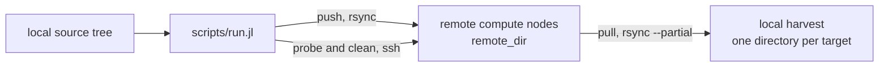

# SshDataBridge.jl

[](https://github.com/PaulGoG/SshDataBridge.jl/actions/workflows/CI.yml)
[](https://github.com/PaulGoG/SshDataBridge.jl/releases/latest)
[](LICENSE)
[](https://julialang.org)
[](#environment-setup)
[](https://github.com/JuliaTesting/Aqua.jl)

Deployment of a simulation code base to several remote compute nodes and retrieval of their results over SSH and rsync, driven by one TOML file and executed for all nodes in parallel from a single command.

```
SshDataBridge/
├── src/                   # Package: configuration parser, ssh and rsync commands, CLI driver
├── scripts/run.jl         # Command-line entry point: probe | push | pull | clean
├── sandbox/run.jl         # Every action exercised against stub binaries, no network
├── test/                  # Test suite and its environment
├── format/                # Formatting environment and script
├── config.example.toml    # Configuration template
├── activate.jl            # Activates and instantiates the root environment
├── Project.toml
├── CHANGELOG.md
├── CITATION.cff
└── SECURITY.md
```

The complete tree is under [Repository layout](#repository-layout).

## Environment setup

Linux with the OpenSSH client, `sshpass`, and `rsync` on the workstation; `rsync` on every remote node; Julia 1.10 or later.

```bash
sudo dnf install sshpass rsync openssh-clients          # Fedora, RHEL
sudo apt-get install sshpass rsync openssh-client       # Debian, Ubuntu
```

Clone the repository and use it in place; this is the intended way to run the driver script, which activates the root environment itself, so no `--project` flag is needed:

```bash
git clone https://github.com/PaulGoG/SshDataBridge.jl.git
cd SshDataBridge.jl
julia activate.jl          # root environment (standard libraries only)
julia test/activate.jl     # test environment, developed against the local source
julia format/activate.jl   # formatting environment
```

The package is not registered. To use the library API from another environment, add it by URL:

```bash
julia -e 'using Pkg; Pkg.add(url="https://github.com/PaulGoG/SshDataBridge.jl")'
```

## Entry points

```bash
cp config.example.toml config.toml                      # then edit paths, hosts, and credentials
julia scripts/run.jl probe                              # reachability, remote rsync, directories
julia scripts/run.jl push --dry-run                     # print the rsync commands
julia scripts/run.jl push                               # deploy to all targets
julia scripts/run.jl pull                               # harvest all targets
julia scripts/run.jl pull --clean-remote --yes          # harvest, verify, then purge the project from the nodes
julia scripts/run.jl clean --yes                        # purge without harvesting
julia scripts/run.jl clean --dry-run                    # show what a purge would remove
julia test/runtests.jl                                  # test suite
julia sandbox/run.jl                                    # exercise every action safely, no network
julia format/format.jl                                  # format the sources
julia format/format.jl --check                          # verify formatting without writing
```

`--config <path>` selects another configuration file; the default is `config.toml` next to `Project.toml`. The exit status is 0 when every target succeeded, 2 when at least one failed, and 1 on a configuration or precondition error.

The script only activates the environment and calls `SshDataBridge.main(args; io, err)`, which returns that exit status instead of calling `exit` and writes the summary tables to `io` and the diagnostics to `err`. Call it from Julia to drive a campaign from another project or to test a configuration in process:

```julia
using SshDataBridge
SshDataBridge.main(["probe", "--config", "config.toml"])
```

## Component status

| Component | Status |
|---|---|
| TOML configuration parser and field validation | Stable |
| `probe`, `push`, `pull` | Stable; covered by process tests against stub binaries; every transfer logged per target |
| `clean` and the post-harvest purge | Stable; `--yes` gate, path denylist, and harvest verification covered by tests |
| Credential delivery to `sshpass` over standard input | Stable; redaction asserted by the test suite and the sandbox |
| `push --delete`, retries, key-based authentication | Not implemented |

## How it works



Every action runs on all targets concurrently and reports per target, so one unreachable node does not stop the rest. Every push and pull appends the files it transfers to a per-target log under `local_destination_root` and reports the number of files and bytes transferred. A purge removes the whole project directory from the node unless `purge_scope` narrows it to the output directory. After a harvest it runs only once a verification pass has found the local copy complete, and never after a harvest narrowed by include patterns. [Actions](#actions) has the details.

## Configuration

`config.toml` is ignored by git because it holds passwords. Unknown keys and values of the wrong type are rejected before anything runs; relative local paths are resolved against the directory of the configuration file and a leading `~` expands to the home directory. `local_source_dir` and `local_destination_root` are mandatory; every other key has a default.

```toml
[globals]
connect_timeout = 10                  # integer > 0; units: s
strict_host_key_checking = "accept-new"   # one of: "accept-new" | "yes" | "no"
compress = true                       # rsync -z
bandwidth_limit = 0                   # integer >= 0; units: KB/s; 0 = unlimited

[push]
local_source_dir = "~/projects/sim_batch_01"   # mandatory; directory deployed to every target
excludes = [".git", ".github", "*.swp"]   # rsync exclude patterns
use_gitignore = true                  # honour the .gitignore of the source tree
require_clean_git = false             # refuse to deploy from a dirty working tree

[pull]
local_destination_root = "~/campaigns/sim_batch_01/harvest"   # mandatory; one subdirectory per target, plus the rsync logs
output_subdir = "output"              # default remote output directory, relative to remote_dir
includes = []                         # harvest only matching files; empty = everything
excludes = ["*.tmp", "core.*", "*~"]  # rsync exclude patterns
collision_strategy = "resume"         # one of: "resume" | "backup" | "abort"
clean_remote_after_pull = false       # purge after a verified harvest (needs --yes)
purge_scope = "project"               # one of: "project" | "output"

[[targets]]
name = "Cluster-Node-01"              # unique; letters, digits, '.', '_', '-'; names the local harvest directory
host = "192.168.1.100"                # hostname, IPv4, or IPv6 literal
port = 22                             # integer in [1, 65535]
user = "scientist"
password = "example_password_1"
remote_dir = "/home/scientist/campaigns/sim_batch_01"   # absolute
output_subdir = "output"              # optional; overrides [pull].output_subdir
strict_host_key_checking = "accept-new"   # optional override
```

## Actions

**probe** runs a short shell script on every target over ssh and reports whether the host answered, whether `rsync` is installed there, and whether the base and output directories exist. Nothing is modified.

**push** creates `remote_dir` if needed and runs `rsync -a --partial` from `local_source_dir`, which must exist, to it. The files transferred are appended to `local_destination_root/<name>.push.rsync.log`, and the summary line reports how many files and bytes were transferred. With `use_gitignore` the `.gitignore` rules of the source tree are applied through a dir-merge filter, so data, plots, and build products of the deployed project stay local without duplicating the rules in `excludes`. Files removed locally are not removed remotely, because `--delete` is deliberately not used. With `require_clean_git` the source tree must be a git working tree without uncommitted changes; the check also applies to dry runs.

**pull** retrieves `remote_dir/output_subdir/` of every target into `local_destination_root/<name>/`. `--partial` resumes interrupted transfers. The files transferred are appended to `local_destination_root/<name>.pull.rsync.log`; the summary line reports the file count and size, and the log is the record of what was retrieved before any purge. With `includes` set, only files matching one of the patterns are harvested and directories left empty are skipped; `excludes` take precedence over `includes`. When the local directory already exists, `collision_strategy` decides: `resume` reuses it, `backup` renames it to `<name>#1`, `<name>#2`, ... before creating a fresh one, `abort` fails the target. A destination that cannot be created fails that target only.

**clean** removes the directory selected by `purge_scope` with `rm -rf`: the whole `remote_dir` by default, because a campaign deploys code that is not meant to stay on the nodes, or only the output directory with `"output"`. The same purge runs after a pull when `--clean-remote` is given or `clean_remote_after_pull` is set, but only once the harvest is verified: the transfer is repeated as `rsync --dry-run --itemize-changes`, and any item it still reports, typically because a job is writing, keeps the remote directory and fails that target although its data were retrieved. Rerun the pull once the node is idle. A purge destroys everything in its scope that the harvest did not copy: files matching `excludes` and, with the `project` scope, everything outside `output_subdir`. Every purge outside a dry run requires `--yes` on the command line. The path is validated first: it must be absolute, at least two components deep, free of `..`, and neither `/`, `/root`, `/home`, the user's home directory, nor anything under `/usr`, `/etc`, `/var`, and the other system directories. A purge is never issued after a harvest narrowed by `includes`, because files the filter left behind would be lost.

All targets are processed concurrently; a failure on one target does not stop the others. Each action ends with a summary table giving the exit code, duration, and message per target.

## Security model

The password of each target is read from `config.toml` into memory. Every remote command runs as `sshpass -d 0 ...`, and the package writes the password to the standard input of `sshpass`, which forwards it to the ssh password prompt. The secret is therefore never part of a command line, never in the environment of any process, and never written to a file, so `ps`, `/proc/<pid>/cmdline`, and `/proc/<pid>/environ` show nothing. Dry-run output, log lines, and the printed form of every configuration and result object omit it as well.

What remains is inherent to password authentication on a shared account: any process running as the same user can read `config.toml` and could attach to `sshpass` while it runs. Keep the file at mode 0600 and prefer key-based authentication where the nodes allow it.

Host keys follow `strict_host_key_checking`: `accept-new` (default) records a host on first contact and refuses a changed key afterwards, `yes` refuses unknown hosts, `no` disables verification and is only acceptable for throwaway test clusters. Every ssh invocation is limited to one password prompt and uses `-n`, so a remote command can never read from the local terminal.

See `SECURITY.md` for the reporting procedure.

## Limitations

- Linux only; developed on Fedora, tested in CI on Ubuntu.
- Password authentication only; ssh keys and agents are not used.
- `push` never deletes remote files.
- A purge removes `remote_dir` only. Julia stores the source text of every precompiled package in its cache files, so a private package deployed with this tool stays readable under `~/.julia/compiled/` on the node until that cache is removed as well.
- Targets are processed by cooperative tasks on one thread, which is sufficient because the work is bound by the network and by rsync itself.
- No retry logic; rerun the action for the targets that failed.

## How to cite

Citation metadata is in [CITATION.cff](CITATION.cff). BibTeX:

```bibtex
@software{Gogita_SshDataBridge_2026,
  author  = {Gogîță, Paul-Adrian},
  title   = {{SshDataBridge.jl}},
  year    = {2026},
  version = {0.2.0},
  url     = {https://github.com/PaulGoG/SshDataBridge.jl}
}
```

## Repository layout

<details>
<summary>Full file tree</summary>

```
SshDataBridge/
├── .github/
│   ├── dependabot.yml       # Weekly updates of the GitHub Actions pins and the formatting environment
│   └── workflows/
│       └── CI.yml           # Test matrix: Julia LTS, latest stable, pre-release
├── .gitignore               # Credentials and manifests
├── .JuliaFormatter.toml     # YAS style, 92 columns
├── CHANGELOG.md             # Release history
├── CITATION.cff             # Citation metadata
├── LICENSE                  # MIT
├── Project.toml             # Package metadata; standard-library dependencies only
├── README.md
├── SECURITY.md              # Threat model and vulnerability reporting
├── activate.jl              # Activates and instantiates the root environment
├── config.example.toml      # Annotated configuration template
├── format/
│   ├── Project.toml         # Formatting environment (JuliaFormatter 2.14+)
│   ├── activate.jl          # Activates the formatting environment
│   └── format.jl            # Formats the repository; --check verifies without writing; refuses files that do not parse
├── sandbox/
│   └── run.jl               # Exercises every action in process against stub binaries, no network
├── scripts/
│   └── run.jl               # Thin entry point around SshDataBridge.main
├── src/
│   ├── SshDataBridge.jl     # Module and exports
│   ├── validation.jl        # Field grammars and remote-path safety rules
│   ├── types.jl             # Configuration, result, and exception types
│   ├── process.jl           # Credential delivery and process execution
│   ├── config.jl            # Typed TOML parser
│   ├── probe.jl             # ssh commands: probe, mkdir, purge
│   ├── transfer.jl          # rsync commands: push, pull; clean-tree check
│   └── cli.jl               # Command-line driver: probe | push | pull | clean
└── test/
    ├── Project.toml         # Test environment: Aqua, JET, ExplicitImports
    ├── activate.jl          # Activates the test environment against the local source
    └── runtests.jl          # Static analysis, unit tests, stub-binary process tests
```

</details>

## License

MIT, see `LICENSE`.
